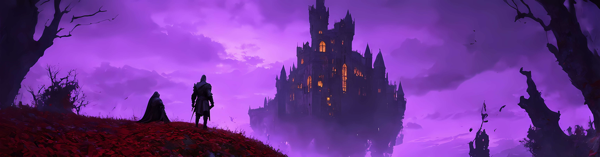

    

 

<h1 align="center">
    
</h1>

<h3 align="center">A passionate CS Graduate</h3>

 

 
 🔭 I’m currently working on **a Steam API Data Engineering Project**
 
 🌱 I’m currently learning **Docker and Kubernetes**

 📜 My favorite book is **_Name of the Wind_** by **_Patrick Rothfuss_** and I'm currently reading **[_Lord of Mysteries_](https://www.webnovel.com/book/lord-of-mysteries_11022733006234505)**

 💽 My current favorite song is **[Come Alive - SānZ, HOYO-MiX](https://open.spotify.com/track/0RtYfzwkgj0sOBuZc3NmSK?si=8a545957551f4509)**

 

 

 
  
 
  
  

  
  
  <a href="https://vyshnav12.github.io" target="_blank">
      <!-- sqlite, safari, google-chrome are other good icon options -->
  </a>
  <a href="https://www.goodreads.com/user/show/88339827-vyshnav" target="_blank">
      <!-- sqlite, safari, google-chrome are other good icon options -->
  </a>

 

 
<h2 align="center">⚒️ Languages-Frameworks-Tools ⚒️</h2>
 

    
     

 
