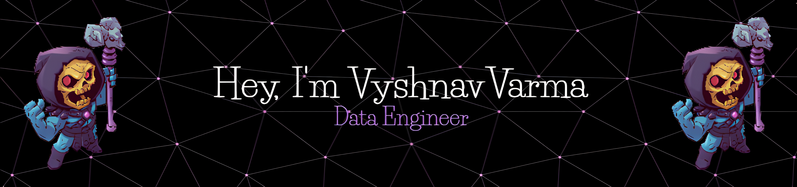

    

 

 

 
 🔭 I'm currently working on a **2D Platformer using Godot**
 
 🌱 I’m currently learning **C# & RAGs for LLMs**

 📜 My favorite book is **[Name of the Wind](https://www.goodreads.com/book/show/34347493-the-name-of-the-wind)** and I'm currently reading **[The Perfect Run](https://www.goodreads.com/book/show/57065516-the-perfect-run)**

 💽 My current favorite song is **[裸の勇者 - Vaundy](https://open.spotify.com/track/3k64vNcgYPkETG7TNgpW4o)**

 

 

 
  
 
  
  

  
  
  <a href="https://vyshnav12.github.io" target="_blank">
      <!-- sqlite, safari, google-chrome are other good icon options -->
  </a>
  <a href="https://www.goodreads.com/user/show/88339827-vyshnav" target="_blank">
      <!-- sqlite, safari, google-chrome are other good icon options -->
  </a>

 
 
<h2 align="center">⚒️ Languages-Frameworks-Tools ⚒️</h2>
 

    
     

 
